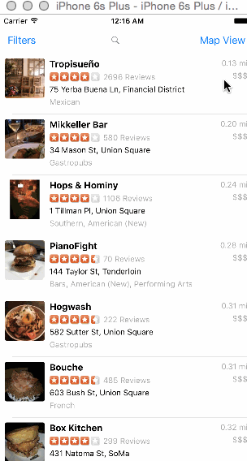

## Yelp

This is a Yelp search app using the [Yelp API](http://developer.rottentomatoes.com/docs/read/JSON).

Time spent: 13
- 3.5: following videos
- 2.5 hrs : implementing search bar cleanly; had edge case due to stupidity and 2am
- 2 hrs : implementing logic for sections, not finished
- 2.5 hrs: finished implementing filters options -> very ugly, pure functionality implemented
- 1.5 hrs: played with diff infinite scroll options, then implemented
- 2 hrs: getting basics of map up and running

### Features

#### Required

- [x] Search results page
   - [x] Table rows should be dynamic height according to the content height
   - [x] Custom cells should have the proper Auto Layout constraints
   - [x] Search bar should be in the navigation bar (doesn't have to expand to show location like the real Yelp app does).
- [x] Filter page. Unfortunately, not all the filters are supported in the Yelp API.
   - [x] The filters you should actually have are: category, sort (best match, distance, highest rated), radius (meters), deals (on/off).
   - [x] The filters table should be organized into sections as in the mock.
   - [x] You can use the default UISwitch for on/off states. Optional: implement a custom switch
   - [x] Clicking on the "Search" button should dismiss the filters page and trigger the search w/ the new filter settings.
   - [x] Display some of the available Yelp categories (choose any 3-4 that you want).

Known bugs: Sometimes the search gets a bit off; had issues reproducting and it was 12:15 so let it go

#### Optional

- [x] Search results page
   - [x] Infinite scroll for restaurant results
   - [x] Implement map view of restaurant results
- [ ] Filter page
   - [ ] Radius filter should expand as in the real Yelp app
   - [ ] Categories should show a subset of the full list with a "See All" row to expand. Category list is here: http://www.yelp.com/developers/documentation/category_list (Links to an external site.)
- [ ] Implement the restaurant detail page.

### Walkthrough

